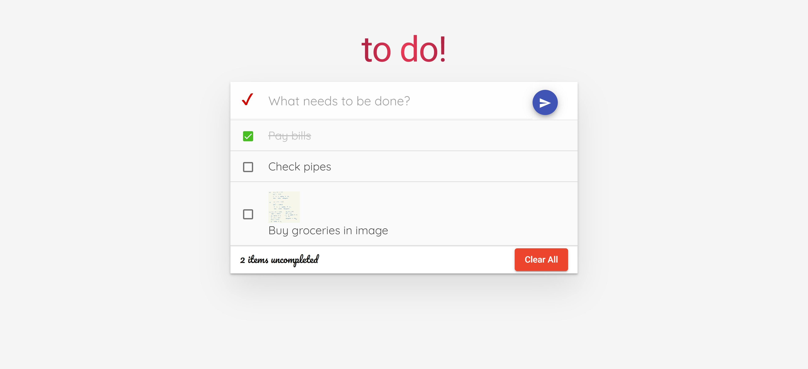

# to do!

**to do!** is a platform to track all your tasks.

You can access **to do!** app [here](https://kaichaoang.github.io/to-do-app/).

Below is a sample image of the app usage.

# Main features
1. Adding a task.
2. Editing a task.
3. Add image to a task.
4. Marking all tasks at once or singly.
5. Removing a task.
6. Clear all tasks.

# User Guide
View the user guide [here](https://kaichaoang.github.io/to-do-app/ug).
