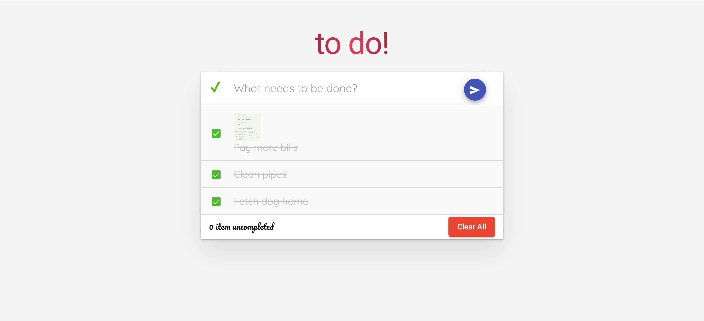

---
<h2>Table of Contents</h2>
* Table of Contents
{:toc}

--------------------------------------------------------------------------------------------------------------------
## Introduction

### **to do!** User Guide

This user guide provides in-depth explanation of each feature and some precautions.

### About **to do!**

**to do!** is a platform to track all your tasks.

--------------------------------------------------------------------------------------------------------------------
## Quick start
You can access **to do!** app [here](https://kaichaoang.github.io/to-do-app/).

Refer to the [features](#features) for in-depth guide of each feature.

--------------------------------------------------------------------------------------------------------------------
## Features
The following are step-by-step guides on the features available in **to do!**.

### Adding a task
Type in the input box, and hit enter or click the button at the end of the input box. By default, a new task is marked as uncompleted.

**Before adding**:

**After adding**:

### Editing a task
To edit a task, hover over the task you want to edit and click on the **pencil** button. This will open up an edit mode textbox and save by hitting enter or the **done** button.

:warning: Editting a task is a destructive operation and there is no undo-ing action.

**Before edit**:

**During edit mode**

**After edit**:

### Adding an image to a task
Hover over the task you want to add an image for and click on the image button. Upload the image you wish to add for a task. Only **one** image can be added per task.

**Before add image**:

**During add image**

**After add image**:

### Marking tasks as completed
To mark a task as completed, check the checkbox within the desired task. To mark **all** tasks as completed, click on the tick symbol on the left side of input box. Once all tasks are completed, you will notice the tick changes color from red to green.

**Before marking all as completed**:

**After marking all as completed**:

### Deleting tasks
To delete a single task, hover over the task to be deleted and click on the bin button.

To delete all tasks at once, go to the bottom of the list of tasks and click on the **Clear All** button.

:warning: Deleting tasks is a destructive operation and there is no undo-ing action.

**Before single delete**:

**After single delete**:

**Before deleting all**:

**After deleting all**:

